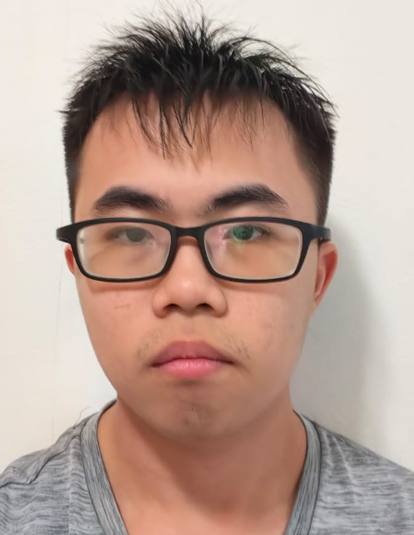
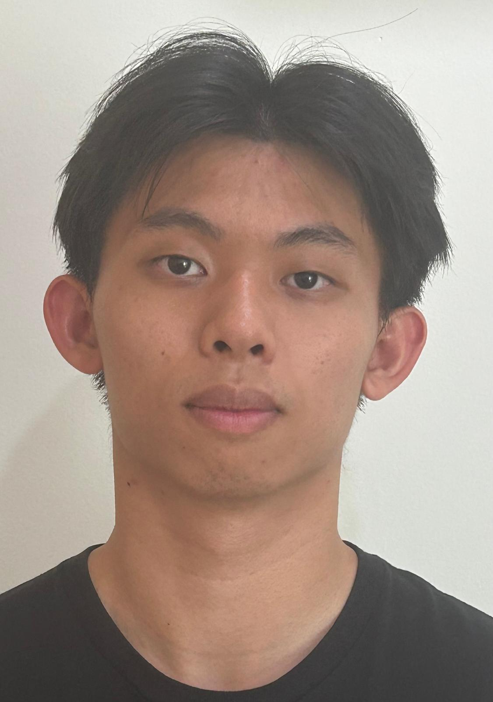

# About Us

We are a team based in the [School of Computing, National University of Singapore](http://www.comp.nus.edu.sg).

You can reach us at the email `seer[at]comp.nus.edu.sg`

## Project team

### Panneer Selvam S/O Rajamanickam

[[github](https://github.com/spadewiz)]

* Role: Team Lead
* Responsibilities: UI

### Lee Hong Sheng

[[github](https://github.com/righthandside)]

* Role:
* Responsibilities:

### Narayanamurthy Sriram

[[github](http://github.com/nsriram18)]

* Role: Developer
* Responsibilities: Dev Ops + Threading

### Toh Wei Jun

[[github](http://github.com/weijun72)]

* Role: Developer
* Responsibilities: UI
