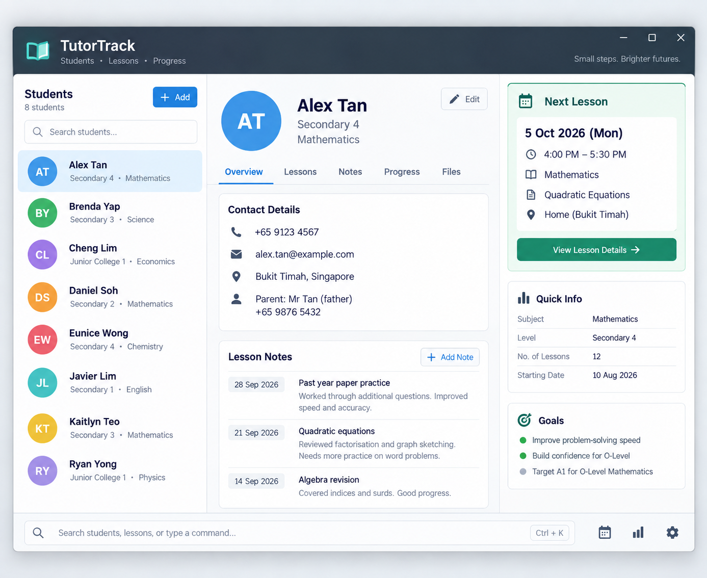

# TutorTrack

**TutorTrack is a desktop application for private tutors who manage multiple students.** It keeps student contact details, academic information, and upcoming lessons together. TutorTrack is optimised for tutors who prefer fast keyboard-driven commands while retaining the benefits of a graphical interface.

* To start using TutorTrack, head to the [_Quick Start_ section of the **User Guide**](UserGuide.html#quick-start).
* To learn how TutorTrack is designed, see the [**Developer Guide**](DeveloperGuide.html).

**Acknowledgements**

* This project is based on the [AddressBook-Level3](https://github.com/se-edu/addressbook-level3) project created by the [SE-EDU initiative](https://se-education.org/).
* Libraries used: [JavaFX](https://openjfx.io/), [Jackson](https://github.com/FasterXML/jackson), [JUnit5](https://github.com/junit-team/junit5)
